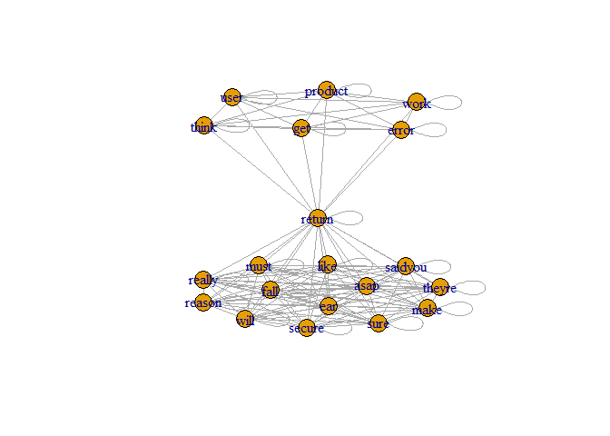
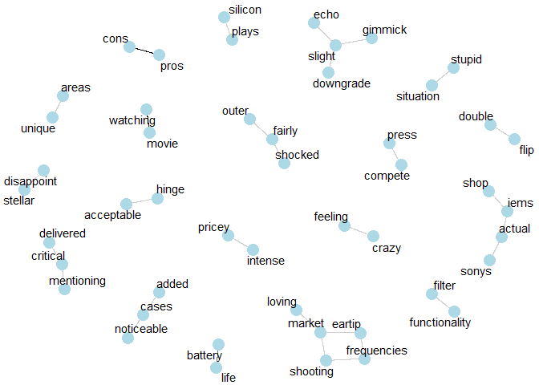

Text Data Visualizations
================
Jessica She
2023-05-23

#### Text Mining Visualizations

Visualizations facilitate the identification of data patterns and
eliminate the need to read interpretation summaries. Also, prior to data
modeling, it is essential to visualize the data to avoid any modeling
issues.

1.  Charts, graphs, and infographics simplify complex data sets. They
    reveal patterns, trends, and relationships in raw data. Users can
    rapidly understand and take conclusions from visualizations.

2.  Decision Making: Visualizing data helps decision makers absorb and
    process information. Visualizations show comparisons and outliers,
    helping stakeholders find areas for development. Visualizations help
    wit the data exploration and improving decision-making.

3.  Communicating Insights: Visualizations help communicate data-driven
    insights. They make information aesthetically appealing and easily
    understandable, facilitating communication. Visualizations make
    complex data and reports easier to understand and remember.

4.  Visualizations help analysts find clusters, correlations, and
    anomalies rapidly by showing data points and patterns.

In this markdown file, some of the commonly used data visualizations
using text data are presented. They include:

1.  Frequency bar plots
2.  Word associations
3.  Word networks
4.  Wordclouds and Wordcloud comparisons

<!-- -->

    ## Warning: package 'readxl' was built under R version 4.2.3

    ## Warning: package 'tidyverse' was built under R version 4.2.3

    ## Warning: package 'ggplot2' was built under R version 4.2.3

    ## Warning: package 'tibble' was built under R version 4.2.3

    ## Warning: package 'tidyr' was built under R version 4.2.3

    ## Warning: package 'readr' was built under R version 4.2.3

    ## Warning: package 'purrr' was built under R version 4.2.3

    ## Warning: package 'dplyr' was built under R version 4.2.3

    ## Warning: package 'stringr' was built under R version 4.2.3

    ## Warning: package 'forcats' was built under R version 4.2.3

    ## Warning: package 'lubridate' was built under R version 4.2.3

    ## ── Attaching core tidyverse packages ──────────────────────── tidyverse 2.0.0 ──
    ## ✔ dplyr     1.1.2     ✔ readr     2.1.4
    ## ✔ forcats   1.0.0     ✔ stringr   1.5.0
    ## ✔ ggplot2   3.4.2     ✔ tibble    3.2.1
    ## ✔ lubridate 1.9.2     ✔ tidyr     1.3.0
    ## ✔ purrr     1.0.1     
    ## ── Conflicts ────────────────────────────────────────── tidyverse_conflicts() ──
    ## ✖ dplyr::filter() masks stats::filter()
    ## ✖ dplyr::lag()    masks stats::lag()
    ## ℹ Use the conflicted package (<http://conflicted.r-lib.org/>) to force all conflicts to become errors

    ## Warning: package 'tidytext' was built under R version 4.2.3

    ## Warning: package 'tm' was built under R version 4.2.3

    ## Loading required package: NLP
    ## 
    ## Attaching package: 'NLP'
    ## 
    ## The following object is masked from 'package:ggplot2':
    ## 
    ##     annotate

    ## Warning: package 'igraph' was built under R version 4.2.3

    ## 
    ## Attaching package: 'igraph'
    ## 
    ## The following objects are masked from 'package:lubridate':
    ## 
    ##     %--%, union
    ## 
    ## The following objects are masked from 'package:dplyr':
    ## 
    ##     as_data_frame, groups, union
    ## 
    ## The following objects are masked from 'package:purrr':
    ## 
    ##     compose, simplify
    ## 
    ## The following object is masked from 'package:tidyr':
    ## 
    ##     crossing
    ## 
    ## The following object is masked from 'package:tibble':
    ## 
    ##     as_data_frame
    ## 
    ## The following objects are masked from 'package:stats':
    ## 
    ##     decompose, spectrum
    ## 
    ## The following object is masked from 'package:base':
    ## 
    ##     union

    ## Warning: package 'qdap' was built under R version 4.2.3

    ## Loading required package: qdapDictionaries
    ## Loading required package: qdapRegex

    ## Warning: package 'qdapRegex' was built under R version 4.2.3

    ## 
    ## Attaching package: 'qdapRegex'
    ## 
    ## The following object is masked from 'package:dplyr':
    ## 
    ##     explain
    ## 
    ## The following object is masked from 'package:ggplot2':
    ## 
    ##     %+%
    ## 
    ## Loading required package: qdapTools

    ## Warning: package 'qdapTools' was built under R version 4.2.3

    ## 
    ## Attaching package: 'qdapTools'
    ## 
    ## The following object is masked from 'package:dplyr':
    ## 
    ##     id
    ## 
    ## Loading required package: RColorBrewer
    ## 
    ## Attaching package: 'qdap'
    ## 
    ## The following object is masked from 'package:igraph':
    ## 
    ##     diversity
    ## 
    ## The following objects are masked from 'package:tm':
    ## 
    ##     as.DocumentTermMatrix, as.TermDocumentMatrix
    ## 
    ## The following object is masked from 'package:NLP':
    ## 
    ##     ngrams
    ## 
    ## The following objects are masked from 'package:base':
    ## 
    ##     Filter, proportions

    ## Warning: package 'widyr' was built under R version 4.2.3

    ## Warning: package 'ggraph' was built under R version 4.2.3

``` r
# Check the dataset and replace NA by spaces 

library(readxl)
sentences <- readxl::read_xlsx(str_c(getwd(),"/Input/BlutoothSpeaker_B09JB8KPNW.xlsx"))
sentences
```

    ## # A tibble: 977 × 1
    ##    review_text                                                                  
    ##    <chr>                                                                        
    ##  1 "Update 2: On day 16, the Left earbud stopped playing as loud as the right. …
    ##  2 "I bought these to help filter out noise at the office generally for music l…
    ##  3 "By no means am I an expert on earbuds or sound. But I'll give my input anyw…
    ##  4 "I actually like these headphones. The lost star is for the fact that they d…
    ##  5 "These ear buds are very clear.\n1. When I'm using it, I can hear the other …
    ##  6 "Excellent sound quality, very good noise cancelling, very good battery life…
    ##  7 "I have been a long time JBL customer. I find their products decently priced…
    ##  8 "I love the sound quality. The bass is great but you must have the right siz…
    ##  9 "I have several pairs of earbuds and these probably have the best sound. Dee…
    ## 10 "I'm a very picky \"audiophile\" and was looking for a TWS set to use out an…
    ## # ℹ 967 more rows

#### Text Pre-processing

- Text Pre-Processing
- Remove line breaks
- Remove special characters
- Remove double quotation marks
- Remove extra spaces
- Convert the upper case strings to lower case
- removing stopwords

``` r
sentences <- sentences %>%
    mutate(review_text = str_replace_all(review_text, "<br />", " ")) %>%
    mutate(review_text = str_remove_all(review_text, "[!@#%^*-?'&,+]")) %>%
    mutate(review_text = str_remove_all(review_text, '\"')) %>%
    mutate(review_text = str_replace_all(review_text, '\\.', " ")) %>%
    mutate(review_text = str_remove_all(review_text, "[:punct:]")) %>%
    mutate(review_text = str_squish(review_text)) %>%
    mutate(review_text = str_to_lower(review_text))
```

``` r
sentences_without_stopwords <- sentences %>%
  mutate(rowId = row_number()) %>%
  unnest_tokens(word, review_text) %>%
  anti_join(stop_words) %>%
  group_by(rowId) %>%
  summarise(review_text = str_c(word, collapse = " ")) %>%
  ungroup()
```

    ## Joining with `by = join_by(word)`

``` r
sentences_without_stopwords %>%
  unnest_tokens(word, review_text) %>%
  # group_by(word) %>%
  # summarise(frequency = n())
  # ungroup
  count(word)
```

    ## # A tibble: 3,664 × 2
    ##    word                n
    ##    <chr>           <int>
    ##  1 ability             7
    ##  2 abriendo            1
    ##  3 abril               2
    ##  4 absolute            1
    ##  5 absolutely         21
    ##  6 acceptable          4
    ##  7 accepted            1
    ##  8 access              3
    ##  9 accessed            1
    ## 10 accessoriesdont     1
    ## # ℹ 3,654 more rows

``` r
sentences_without_stopwords %>%
  unnest_tokens(word, review_text) %>%
  # group_by(word) %>%
  # summarise(frequency = n())
  # ungroup
  count(word) %>%
  mutate(word_freq_rank = dense_rank(desc(n))) %>%
  arrange(word_freq_rank) %>%
  filter(word_freq_rank <= 20) %>%
  # Grammar of graphics
  # Layer by layer approach
  # Data Layer
  # Type of graph (geom_line, geom_point, geom_col or geom_bar,)
  ggplot() +
    geom_bar(aes(x = reorder(word,n), y = n), stat = "identity") +
    geom_text(aes(x = reorder(word,n), y = n, label = n, hjust = -1)) +
  coord_flip() +
  labs(x = "", y = "Frequency")
```

<!-- -->

#### Implement text mining (pre-processing and visuliazation) using “tm” package.

``` r
# Create a pre-processing function to reuse the common steps
# Vectorize the source
# Passing the key words. The unnest_token would not work in tm package.
corpus <- VectorSource(sentences$review_text)
corpus <- Corpus(corpus)
#work on preloaded function
corpus <- tm_map(corpus, tolower)
```

    ## Warning in tm_map.SimpleCorpus(corpus, tolower): transformation drops documents

``` r
corpus <- tm_map(corpus, removeWords, stopwords(kind ="en"))
```

    ## Warning in tm_map.SimpleCorpus(corpus, removeWords, stopwords(kind = "en")):
    ## transformation drops documents

``` r
# Custom Words
custom_words <- c("shh", "dummy")
corpus <- tm_map(corpus, removeWords, custom_words)
```

    ## Warning in tm_map.SimpleCorpus(corpus, removeWords, custom_words):
    ## transformation drops documents

``` r
corpus <- tm_map(corpus, removeNumbers)
```

    ## Warning in tm_map.SimpleCorpus(corpus, removeNumbers): transformation drops
    ## documents

``` r
corpus <- tm_map(corpus, stripWhitespace)
```

    ## Warning in tm_map.SimpleCorpus(corpus, stripWhitespace): transformation drops
    ## documents

``` r
sentences_tm_processed <- corpus$content
sentences_tm_processed <- data.frame(
  rowId = seq(1, length(sentences_tm_processed)),
    review_text = sentences_tm_processed
)
```

#### In text mining word associations are similar to correlations in quantitative methods.

``` r
# In each sentence - how many times a word repeated, and what is that word in the overall corpus.

# "refund" - what are the other highly associated keywords
# TermDocumentMatrix - in how many documents it appears
# DocumentTermMatrix - each document, how many times the term is appeared

tdm_association <- TermDocumentMatrix(corpus)
word_associations <- findAssocs(tdm_association, "clarity", 0.25)
word_associations <- as.data.frame(word_associations)
word_associations$correlated_words <- row.names(word_associations)
ggplot(word_associations) + 
  geom_point(aes(x= clarity, y = correlated_words))
```

<!-- -->

#### Word association graphs (Usual for social media data analysis)

- Create adjacency matrix using the reviews that contain returns.

``` r
# Specific to social media data
  #terms %*% t(terms)
# 1. tdm_matrix
# 2. associations_matrix tdm_matrix %% t(tdm_matrix)
# 3. graph.adjacency(associations_matrix)
reviews_of_return <- sentences_tm_processed[str_detect(sentences_tm_processed$review_text,"return"), ]
reviews_of_return <- reviews_of_return %>%
  filter(str_length(review_text)< 100)
         
reviews_of_return <- na.omit(reviews_of_return)
reviews_of_return <- head(reviews_of_return, 2)
corpus <- Corpus(VectorSource(reviews_of_return$review_text))
tdm_associations <- TermDocumentMatrix(corpus)
tdm_matrix <- as.matrix(tdm_associations)
associations_matrix <- tdm_matrix %*% t(tdm_matrix)
output_association <- graph.adjacency(associations_matrix,
                                      mode = "undirected",
                                      weighted = TRUE)
plot.igraph(output_association)
```

<!-- -->

#### Using qdap - word_network_plot()

``` r
word_network_plot(reviews_of_return$review_text)
```

<!-- -->

#### qdap word_associate() plot

``` r
reviews_of_return <- sentences_tm_processed[str_detect(sentences_tm_processed$review_text,"return"), ]
reviews_of_return <- reviews_of_return %>%
  filter(str_length(review_text)< 100)
         
reviews_of_return <- na.omit(reviews_of_return)
word_associate(reviews_of_return$review_text,
               match.string = c("return"),
               stopwords = Top200Words, network.plot = TRUE)
```

    ## Warning in text2color(words = V(g)$label, recode.words = target.words, colors =
    ## label.colors): length of colors should be 1 more than length of recode.words

<!-- -->

    ##    row group unit text                                                                                             
    ## 1    1   all    1 like saidyou must make sure theyre really secure ear will fall reason return asap                
    ## 2    2   all    2 get work think user error product return                                                         
    ## 3    3   all    3 bought child hair long kept messing buttons good product returned daughter couldnt use           
    ## 4    4   all    4 didnt pay full price returned half price right                                                   
    ## 5    5   all    5    wife didnt like ok returned original box plus new mailer didnt receive full refund 🖥          
    ## 6    6   all    6 bought worse ive cut n middle conversation noise cancelling returned ran time                    
    ## 7    7   all    7 overall product quality however stay tried cap sizes provided still stay returned day using      
    ## 8    8   all    8 fit stay ended wearing hat hold found even highest volume weak certainly cancel noise returning  
    ## 9    9   all    9 stay ears disappointed unfortunately country couldnt returned time total waste money             
    ## 10  10   all   10 sound sufficient stay securely ears disappointing window return passed can get money back        
    ## 11  11   all   11 great sound stopped working less one month return window just closed                             
    ## 12  12   all   12 sadly missed return window amazon wouldnt connect anymore despite restarts etcc                  
    ## 13  13   all   13 impressed came box already opened can see someone already used marks will returning expecting new
    ## 14  14   all   14 loud enough left earbud bass pair feels cheap returned                                           
    ## 15  15   all   15 noise cancelling stopped working one ear bud just late amazon return jbl didnt respond           
    ## 16  16   all   16 absolutely mention spyware item description will returning                                       
    ## 17  17   all   17 came broken couldnt return christmas gift didnt time return                                      
    ## 18  18   all   18 couldnt return threw away box hell dont last minutes ear                                         
    ## 19  19   all   19 returned didnt work use helmet                                                                   
    ## 20  20   all   20 matter even change cushions still fell ears sound good return                                    
    ## 21  21   all   21 noise cancelling good returned                                                                   
    ## 22  22   all   22 horrible fit ugly appearance useless return                                                      
    ## 23  23   all   23 sorry returned days ago worth

    ## 
    ## Match Terms
    ## ===========

    ## 
    ## List 1:
    ## return, returned, returning

    ## 

#### widyr word correlations and word counts

``` r
#<<"Fetch word correlations from 0.8 to 0.9">>  %>%
library(textcat)
```

    ## Warning: package 'textcat' was built under R version 4.2.3

``` r
# Top 80% to 90% correlated words
sentences_tm_processed %>%
  filter(textcat(review_text)== "english") %>%
  unnest_tokens(word, review_text) %>%
  pairwise_cor(word, rowId) %>%
  filter((correlation > 0.8) & (correlation <0.9)) %>%
  graph_from_data_frame() %>%
  ggraph(layout = "fr") +
  geom_edge_link(aes(edge_alpha = correlation), show.legend = F) +
  geom_node_point(color = "lightblue", size = 5) +
  geom_node_text(aes(label = name), repel = T) + 
  theme_void()
```

    ## Warning: Using the `size` aesthetic in this geom was deprecated in ggplot2 3.4.0.
    ## ℹ Please use `linewidth` in the `default_aes` field and elsewhere instead.
    ## This warning is displayed once every 8 hours.
    ## Call `lifecycle::last_lifecycle_warnings()` to see where this warning was
    ## generated.

<!-- -->

#### Dendograms
