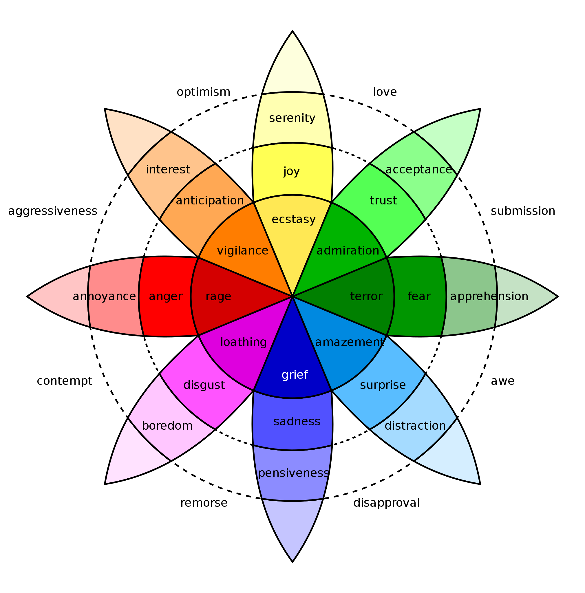

Sentiment Analysis
================
Jessica She
2023-05-25

#### Opinion Mining or Sentiment Analysis & TF-IDF (Term Frequency - Inverse Document Frequency) representation

- Sentiment Analysis is the process of extracting an author’s emotional
  intent from the text.
- When more than one topic is discussed in a text and each topic has a
  distinct set of sentiments attached by the author, opinion mining
  becomes quite difficult. Therefore, extracting the topic from the text
  becomes crucial. However, topic extraction necessitates a different
  text representation known as TF-IDF. In favor of straightforward term
  frequency, the TF-IDF value increases with the occurrence of the term
  but is offset by the word’s overall frequency in the corpus. The
  offsetting effect helps in the removal of frequently occurring terms
  that may not provide useful information. For instance, if all reviews
  are about “Batman,” the “Batman” keyword will appear in all reviews.
  The inclusion of “Batman” in the analysis would yield no new insights.
- Sentiment Analysis is based on a framework that classifies a set of
  keywords specific to a sentiment and assigns a score to the level of
  sentiment (emotion) captured by the keywords. There are eight
  psychologically evolved emotions, that are widely accepted:

1.  anger
2.  fear
3.  sadness
4.  disgust
5.  surprise
6.  anticipation
7.  trust
8.  joy

 - Beyond sentiment
analysis for emotional states, an easier approach is to merely state
whether a document is positive or negative. This is called polarity of
text.

- Approaches to sentiment analysis:

1.  tidytext lexicon approach
2.  “sentiment” package for polarity (Uses a Bayesian Approach)
3.  qdap implementation of polarity (Accounts for valence shifts)
4.  Machine Learning approach

- Training Set 80% of data (Try to run a mode (linear regression) and
  calculate the least error. We stop there and capture coefficients. Y =
  aX + e a is our coefficient)
- Test - 20% of data (To predict Y. If the prediction is as close to R^2
  accuracy, we say our training coefficients are great)

We will take another 80% of data sample and capture the coefficients.
Learning

Continuous value prediction (Regression). or classification
(Cross-entropy). Naive - Bayes (Probability \> 0.5 then position, else
negative) We should have the true label (positive or negative) for a
sentence. Then, we can predict the future sentence is positive or
negative. Supervised Learning Model. 0-9 Accuracy. If accuracy is good,
then can do Future prediction.

Unsupervised Machine Learning. (Positive vs Negative) LDA is an
unsupervised technique Topic - Bluetooth Speakers, sound quality, color,
vendor.

Clustering

Valence shifting is the change in emotions/sentiments due to negation in
sentences

Why does the subjectivity lexicons work?

- Explanation is due to the Zip’s law and the priciple of least effort.
  The average person probably has tens of thousands of words in his or
  her personal vocabulary, so a limited subjectivity lexicon may seem
  inappropriate. Numerous additional factors, including ethnicity,
  gender, and demographics, influence the outcome. Therefore, it may
  appear that a lexicon with approximately 7,000 entries would not be
  sufficient.

- The average person probably has tens of thousands of words in his or
  her personal vocabulary, so a limited subjectivity lexicon may seem
  inappropriate. Numerous additional factors, including ethnicity,
  gender, and demographics, influence the outcome. Therefore, it may
  appear that a lexicon with approximately 7,000 entries would not be
  sufficient.

- However, according to Zipf’s law, the frequency of a word in a
  document is inversely proportional to its rank of appearance. For
  instance, the most frequent word on a list will appear approximately
  twice as often as the second most frequent word, three times as often
  as the third, and so on. As a result, humans utilize a large number of
  repetitive words and exert minimal effort when communicating. All of
  the words are not required to analyze the overarching sentiment.

**Usage of Sentiment Analysis in real life scenarios**

- Extract sentiment polarity of a product over time and make updates to
  the product
- Understand the effectiveness of a marketing campaign
- Social media data analysis to understand the public response to a new
  policy

``` r
library(readxl)
library(tidytext)
library(tidyverse)
library(tm)
library(qdap)
```

``` r
airbnb_reviews <- read_excel(paste0(getwd(), "/Input/Airbnb_reviews.xlsx"))
```

#### Approach 1. Using sentiment lexicons from tidytext.

- There are four popular lexicons available under tidytext package.

1.  nrc
2.  afinn
3.  bing
4.  loughran

``` r
library(textdata)
nrc_lexicon <- get_sentiments("nrc")
afinn_lexicon <- get_sentiments("afinn")
bing_lexicon <- get_sentiments("bing")
loughran_lexicon <- get_sentiments("loughran")
```

- Extract the sentiment for each review using “bing” lexicon.
- If we combine all the reviews into a series of sentences and then
  convert these sentences into words, the dimension per review is lost.
  Therefore, we must identify each review individually prior to
  conducting word-level analysis. The purpose of the word-level analysis
  is to determine whether the review words convey positive, negative, or
  other possible emotions. The word level sentiments are used to compute
  the overall review sentiment. (Reviewer_id is already present in the
  data. Make sure that it is unique for each review)

``` r
airbnb_reviews <- airbnb_reviews %>%
  select(review_id, comments)
```

``` r
text_pre_process <- function(corpus) {
corpus <- tm_map(corpus, tolower)
corpus <- tm_map(corpus, removeWords, stopwords(kind ="en"))
corpus <- tm_map(corpus, removeNumbers)
corpus <- tm_map(corpus, stripWhitespace)
return(corpus)
}
```

``` r
corpus <- Corpus (VectorSource(airbnb_reviews$comments))
corpus <- text_pre_process(corpus) # Calling the text_pre_process function. 
airbnb_reviews_processed <- corpus$content
airbnb_reviews_processed <- data.frame(review_text = airbnb_reviews_processed)
airbnb_reviews_processed <- airbnb_reviews_processed %>%
  mutate(review_id = row_number(),
         review_text = str_squish(review_text))
```

#### How to get the sentiment of each review?

- Step 1: Break teh sentence into words
- Step 2: Get the sentiment of each word
- Step 3: Covert the sentiment to numeric
- Step 4: Capture overall sentiment for a sentence

``` r
library(dplyr)
airbnb_reviews_processed_sentiment <- airbnb_reviews_processed %>%
  # Step 1 
  unnest_tokens(word, review_text) %>%
  
  # Step 2
  inner_join(bing_lexicon) %>%

  # Step 3

  #mutate(numeric_sentiment = ifelse(sentiment == "positive", 1)
  mutate(numeric_sentiment = case_when(
    sentiment == "positive" ~ 1, 
    TRUE ~ -1
  )) %>%
  
  # Step 4
  select(review_id, numeric_sentiment) %>%
  group_by(review_id) %>%
  summarise(overall_sentiment = sum(numeric_sentiment)) %>%
  ungroup() %>%
  select(review_id, overall_sentiment)

# Add the overall sentiment to the original dataset
airbnb_reviews_processed <- airbnb_reviews_processed %>%
  left_join(airbnb_reviews_processed_sentiment)

# Just checking how many negative sentiment reviews are present in the dataset
# nrow(airbnb_reviews_processed[airbnb_reviews_processed$overall_sentiment <0,])
```

#### load teh wordcloud library to create wordclouds

- Use comparison.cloud to create two word clouds in a single word cloud

``` r
# tm package functions to get the term frequency 
# TermDocumentMatrix()
library(wordcloud)
# Approach 1
#positive_sentences <- airbnb_reviews_processed[
#  airbnb_reviews_processed$overall_sentiment < 0, ]$review_text

# Approach 2 
positive_sentences <- paste(subset(airbnb_reviews_processed,
                             airbnb_reviews_processed$overall_sentiment > 0),
                            collapse = " ")

negative_sentences <- paste(subset(airbnb_reviews_processed,
                             airbnb_reviews_processed$overall_sentiment < 0),
                            collapse = " ")
all_sentences <- c(positive_sentences,
                   negative_sentences)
all_sentences_corpus <- Corpus(VectorSource(all_sentences))
all_sentences_tdm <- TermDocumentMatrix(all_sentences_corpus)
all_sentences_matrix <- as.matrix(all_sentences_tdm)
colnames(all_sentences_matrix) <- c("positive", "negative")
comparison.cloud(all_sentences_matrix,
                 max.words=100,
                 colors = c("blue", "red"))
```

<!-- -->

``` r
# Approach 2 to capture sentiment polarity using qdap
reviews_polarity <- polarity(airbnb_reviews_processed$review_text)
airbnb_reviews_processed$sentiment_polarity <- 
  reviews_polarity$all$polarity
airbnb_reviews_processed$sentiment_polarity <-
  scale(airbnb_reviews_processed$sentiment_polarity)
```
