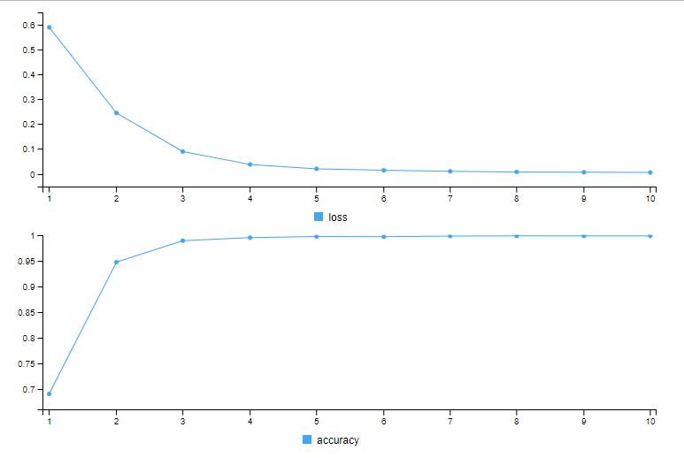
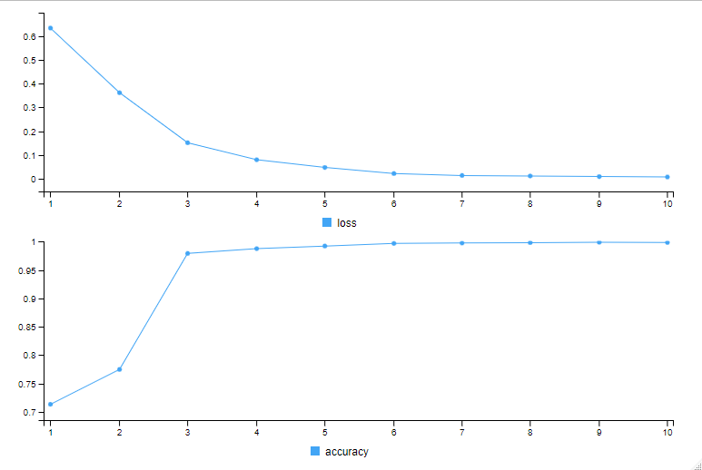

```{r setup, include=FALSE}
knitr::opts_chunk$set(echo = TRUE)
```


```{r load libraries}
library(stringr)
library(tidyr)
library(dplyr)
library(tm)
library(keras) # wrapper for tensorflow
library(tensorflow)
library(purrr)
library(text2vec)
library(caret)
library(readr)
```

```{r read data}
# Read dataset from working directory 
email_data <- read_csv(str_c(getwd(),"/Input/Spam_Ham.csv"))

# Only require the text column and label_num
email_data <- email_data[, c("text", "label_num")]
```

```{r Text processing}

# Remove line breaks
email_data$text <- gsub("\\r|\\n", " ", email_data$text)

# Convert to lowercase
email_data$text <- tolower(email_data$text)

# Remove stop words
stopwords <- stopwords("english")
email_data$text <- removeWords(email_data$text, stopwords)

# Strip white spaces
email_data$text <- str_trim(email_data$text)

# Remove numbers
email_data$text <- gsub("\\d+", "", email_data$text)

# Remove punctuation
email_data$text <- gsub("[[:punct:]]", "", email_data$text)

# Remove special characters
email_data$text <- gsub("[^[:alnum:][:space:]]", "", email_data$text)

# Remove extra spaces in between 
email_data$text <- str_squish(email_data$text)
```

```{r Create Training Dataset & Testing Dataset}
# setting seed
set.seed(1234)
train_test_sample <- sample(c(0,1), size = 5171, 
                            replace = T, 
                            prob = c(0.8,0.2))

table(train_test_sample)

x_train <- email_data[train_test_sample ==0, ]
x_test <- email_data[train_test_sample ==1, ]
y_train <- x_train$label_num
y_test <- x_test$label_num
```

```{r Input data for neural network}
tokenizer <- text_tokenizer(50000)
tokenizer_train <- tokenizer %>%
  fit_text_tokenizer(x_train$text)

tokenizer_test <- tokenizer %>%
  fit_text_tokenizer(x_test$text)

# without using texts_to_sequences, we don't have idea how to differentiate each review
tokenizer_train <- texts_to_sequences(tokenizer_train, x_train$text)
tokenizer_test <- texts_to_sequences(tokenizer_test, x_test$text)

word_list <- strsplit(email_data$text, "\\s+")
word_counts <- sapply(word_list, length)
average_word_count <- mean(word_counts)

sequence_input_train <- pad_sequences(tokenizer_train,
                                      maxlen = average_word_count)

sequence_input_test <- pad_sequences(tokenizer_test,
                                     maxlen = average_word_count)

num_tokens <- length(unique(tokenizer$word_index))

```

```{r setting Rnn Model}

set.seed(1234)

# Simple Recurrent Neural Network
model <- keras_model_sequential() %>%
  layer_embedding(input_dim = num_tokens + 1,
                  output_dim = 300, # expecting embedding matrix of 300 dims
                  input_length = average_word_count # Max length of words in each review
  ) %>%
  layer_simple_rnn(units = 64) %>% # all the computer, the matrix, the weight matrix. 64
  layer_dense(units = 1, activation = "sigmoid") # activation is sigmoid because the output is 0 or 1 

model %>% compile(
  optimizer = "adam",
  loss = "binary_crossentropy",
  metrics = c("accuracy")
)

model %>% keras::fit(
  sequence_input_train, y_train,
  epochs = 10, 
  batch_size = 500
)
```
```{r plot}

```

```{r Evaluate performance, predict and create confusion matrix using rnn}
# Test the model performance
model %>%
  evaluate(sequence_input_test,
           y_test)

# Make predictions a create a confusion matrix
predicted_rnn <- model %>%
  predict(sequence_input_test)

predicted_outcome_rnn <- ifelse(predicted_rnn > 0.5, 1, 0)
confusion_matrix_rnn <- as.data.frame(table(y_test, predicted_outcome_rnn))

confusion_matrix_rnn

accuracy_rnn <- sum(
  confusion_matrix_rnn[confusion_matrix_rnn[, "y_test"] == confusion_matrix_rnn[, "predicted_outcome_rnn"], c("Freq")]) / sum(confusion_matrix_rnn[, "Freq"])

accuracy_rnn
```

```{r Setting LSTM Model}
# LSTM model
  set.seed(1234)

  model <- keras_model_sequential() %>%
  layer_embedding(input_dim = num_tokens + 1,
                  output_dim = 300, # expecting embedding matrix of 300 dims
                  input_length = average_word_count # Max length of words in each review
  ) %>%
  layer_lstm(units = 64) %>%
  layer_dense(units = 1, activation = "sigmoid")
  
  model %>% compile(
    optimizer = "adam",
    loss = "binary_crossentropy",
    metrics = c("accuracy")
  )
  
  model %>% keras::fit(
    sequence_input_train, y_train,
    epochs = 10, 
    batch_size = 500
  )
  
  # Make predictions a create a confusion matrix
  predicted_lstm <- model %>%
  predict(sequence_input_test)
  
  predicted_outcome_lstm <- ifelse(predicted_lstm > 0.5, 1, 0)
  confusion_matrix_lstm <- as.data.frame(table(y_test, predicted_outcome_lstm))
  
  confusion_matrix_lstm
  
  accuracy_lstm <- sum(
    confusion_matrix_lstm[confusion_matrix_lstm[, "y_test"] == confusion_matrix_lstm[, "predicted_outcome_lstm"], c("Freq")]) / sum(confusion_matrix_lstm[, "Freq"])
  accuracy_lstm

``` 

```{r plot2 }

```
