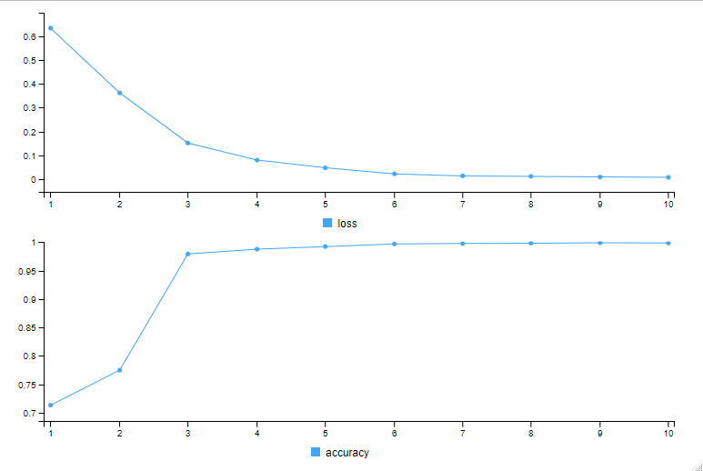

HW05
================
Jessica She
2023-06-18

``` r
library(stringr)
```

    ## Warning: package 'stringr' was built under R version 4.2.3

``` r
library(tidyr)
```

    ## Warning: package 'tidyr' was built under R version 4.2.3

``` r
library(dplyr)
```

    ## Warning: package 'dplyr' was built under R version 4.2.3

    ## 
    ## Attaching package: 'dplyr'

    ## The following objects are masked from 'package:stats':
    ## 
    ##     filter, lag

    ## The following objects are masked from 'package:base':
    ## 
    ##     intersect, setdiff, setequal, union

``` r
library(tm)
```

    ## Warning: package 'tm' was built under R version 4.2.3

    ## Loading required package: NLP

``` r
library(keras) # wrapper for tensorflow
```

    ## Warning: package 'keras' was built under R version 4.2.3

``` r
library(tensorflow)
```

    ## Warning: package 'tensorflow' was built under R version 4.2.3

``` r
library(purrr)
```

    ## Warning: package 'purrr' was built under R version 4.2.3

``` r
library(text2vec)
```

    ## Warning: package 'text2vec' was built under R version 4.2.3

    ## 
    ## Attaching package: 'text2vec'

    ## The following objects are masked from 'package:keras':
    ## 
    ##     fit, normalize

``` r
library(caret)
```

    ## Warning: package 'caret' was built under R version 4.2.3

    ## Loading required package: ggplot2

    ## Warning: package 'ggplot2' was built under R version 4.2.3

    ## 
    ## Attaching package: 'ggplot2'

    ## The following object is masked from 'package:NLP':
    ## 
    ##     annotate

    ## Loading required package: lattice

    ## 
    ## Attaching package: 'caret'

    ## The following object is masked from 'package:purrr':
    ## 
    ##     lift

    ## The following object is masked from 'package:tensorflow':
    ## 
    ##     train

``` r
library(readr)
```

    ## Warning: package 'readr' was built under R version 4.2.3

``` r
# Read dataset from working directory 
email_data <- read_csv(str_c(getwd(),"/Input/Spam_Ham.csv"))
```

    ## New names:
    ## Rows: 5171 Columns: 4
    ## ── Column specification
    ## ──────────────────────────────────────────────────────── Delimiter: "," chr
    ## (2): label, text dbl (2): ...1, label_num
    ## ℹ Use `spec()` to retrieve the full column specification for this data. ℹ
    ## Specify the column types or set `show_col_types = FALSE` to quiet this message.
    ## • `` -> `...1`

``` r
# Only require the text column and label_num
email_data <- email_data[, c("text", "label_num")]
```

``` r
# Remove line breaks
email_data$text <- gsub("\\r|\\n", " ", email_data$text)

# Convert to lowercase
email_data$text <- tolower(email_data$text)

# Remove stop words
stopwords <- stopwords("english")
email_data$text <- removeWords(email_data$text, stopwords)

# Strip white spaces
email_data$text <- str_trim(email_data$text)

# Remove numbers
email_data$text <- gsub("\\d+", "", email_data$text)

# Remove punctuation
email_data$text <- gsub("[[:punct:]]", "", email_data$text)

# Remove special characters
email_data$text <- gsub("[^[:alnum:][:space:]]", "", email_data$text)

# Remove extra spaces in between 
email_data$text <- str_squish(email_data$text)
```

``` r
# setting seed
set.seed(1234)
train_test_sample <- sample(c(0,1), size = 5171, 
                            replace = T, 
                            prob = c(0.8,0.2))

table(train_test_sample)
```

    ## train_test_sample
    ##    0    1 
    ## 4125 1046

``` r
x_train <- email_data[train_test_sample ==0, ]
x_test <- email_data[train_test_sample ==1, ]
y_train <- x_train$label_num
y_test <- x_test$label_num
```

``` r
tokenizer <- text_tokenizer(50000)
tokenizer_train <- tokenizer %>%
  fit_text_tokenizer(x_train$text)

tokenizer_test <- tokenizer %>%
  fit_text_tokenizer(x_test$text)

# without using texts_to_sequences, we don't have idea how to differentiate each review
tokenizer_train <- texts_to_sequences(tokenizer_train, x_train$text)
tokenizer_test <- texts_to_sequences(tokenizer_test, x_test$text)

word_list <- strsplit(email_data$text, "\\s+")
word_counts <- sapply(word_list, length)
average_word_count <- mean(word_counts)

sequence_input_train <- pad_sequences(tokenizer_train,
                                      maxlen = average_word_count)

sequence_input_test <- pad_sequences(tokenizer_test,
                                     maxlen = average_word_count)

num_tokens <- length(unique(tokenizer$word_index))
```

``` r
set.seed(1234)

# Simple Recurrent Neural Network
model <- keras_model_sequential() %>%
  layer_embedding(input_dim = num_tokens + 1,
                  output_dim = 300, # expecting embedding matrix of 300 dims
                  input_length = average_word_count # Max length of words in each review
  ) %>%
  layer_simple_rnn(units = 64) %>% # all the computer, the matrix, the weight matrix. 64
  layer_dense(units = 1, activation = "sigmoid") # activation is sigmoid because the output is 0 or 1 

model %>% compile(
  optimizer = "adam",
  loss = "binary_crossentropy",
  metrics = c("accuracy")
)

model %>% keras::fit(
  sequence_input_train, y_train,
  epochs = 10, 
  batch_size = 500
)
```

``` r
knitr::include_graphics("Rnn_plot.png")
```


``` r
# Test the model performance
model %>%
  evaluate(sequence_input_test,
           y_test)
```

    ##      loss  accuracy 
    ## 0.1179551 0.9598470

``` r
# Make predictions a create a confusion matrix
predicted_rnn <- model %>%
  predict(sequence_input_test)

predicted_outcome_rnn <- ifelse(predicted_rnn > 0.5, 1, 0)
confusion_matrix_rnn <- as.data.frame(table(y_test, predicted_outcome_rnn))

confusion_matrix_rnn
```

    ##   y_test predicted_outcome_rnn Freq
    ## 1      0                     0  748
    ## 2      1                     0   39
    ## 3      0                     1    3
    ## 4      1                     1  256

``` r
accuracy_rnn <- sum(
  confusion_matrix_rnn[confusion_matrix_rnn[, "y_test"] == confusion_matrix_rnn[, "predicted_outcome_rnn"], c("Freq")]) / sum(confusion_matrix_rnn[, "Freq"])

accuracy_rnn
```

    ## [1] 0.959847

``` r
# LSTM model
  set.seed(1234)

  model <- keras_model_sequential() %>%
  layer_embedding(input_dim = num_tokens + 1,
                  output_dim = 300, # expecting embedding matrix of 300 dims
                  input_length = average_word_count # Max length of words in each review
  ) %>%
  layer_lstm(units = 64) %>%
  layer_dense(units = 1, activation = "sigmoid")
  
  model %>% compile(
    optimizer = "adam",
    loss = "binary_crossentropy",
    metrics = c("accuracy")
  )
  
  model %>% keras::fit(
    sequence_input_train, y_train,
    epochs = 10, 
    batch_size = 500
  )
  
  # Make predictions a create a confusion matrix
  predicted_lstm <- model %>%
  predict(sequence_input_test)
  
  predicted_outcome_lstm <- ifelse(predicted_lstm > 0.5, 1, 0)
  confusion_matrix_lstm <- as.data.frame(table(y_test, predicted_outcome_lstm))
  
  confusion_matrix_lstm
```

    ##   y_test predicted_outcome_lstm Freq
    ## 1      0                      0  737
    ## 2      1                      0   11
    ## 3      0                      1   14
    ## 4      1                      1  284

``` r
  accuracy_lstm <- sum(
    confusion_matrix_lstm[confusion_matrix_lstm[, "y_test"] == confusion_matrix_lstm[, "predicted_outcome_lstm"], c("Freq")]) / sum(confusion_matrix_lstm[, "Freq"])
  accuracy_lstm
```

    ## [1] 0.9760994

``` r

```


